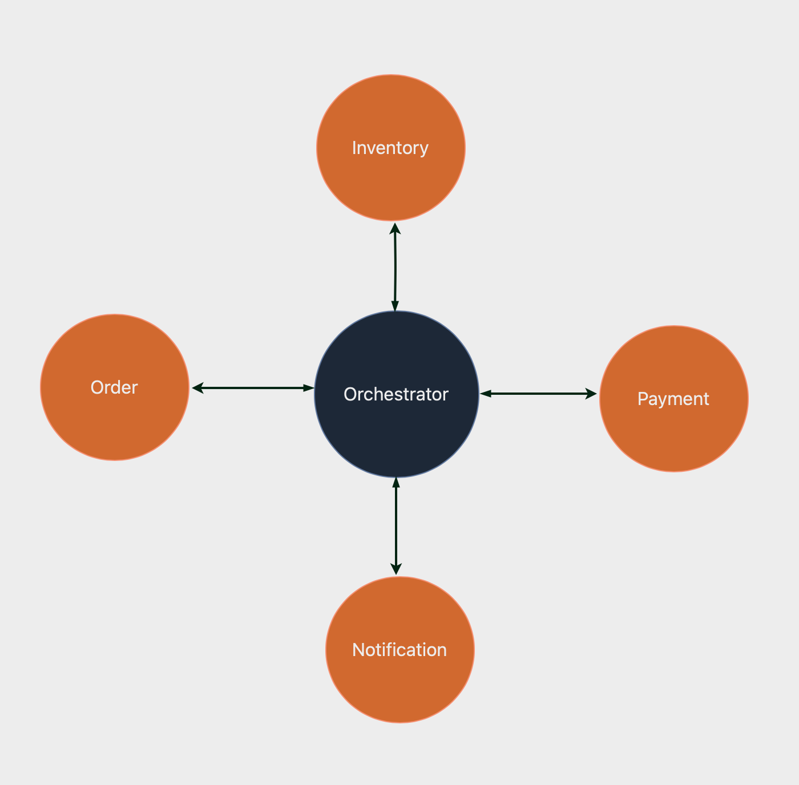
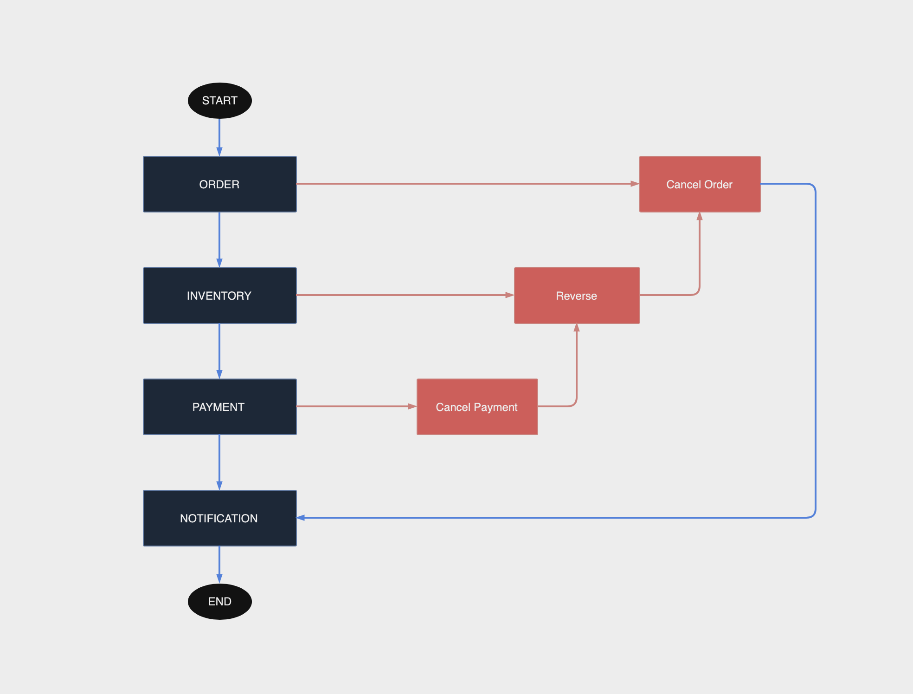

# Saga Pattern (Orchestration Saga) with Spring Boot and RabbitMQ
This project demonstrates the implementation of the Saga orchestration pattern using Spring Boot and RabbitMQ. It manages distributed transactions across multiple microservices to ensure data consistency in a distributed system.

# ️🏗 Services & Architecture
The project consists of the following microservices:
* 🛒 **Order Service**: Handles order creation and management.
* 📦 **Inventory Service**: Manages product inventory.
* 💳 **Payment Service**: Processes payments for orders.
* 📬 **Notification Service**: Sends notifications to users.
* 🔃 **Orchestrator Service**: Coordinates the entire saga, managing the sequence of steps across services.
-  All services are connected to the Orchestrator Service.
-  Services do not communicate directly with each other.
- All services communicate via 🐰 RabbitMQ for asynchronous messaging.



# 🔄 Saga Flow
1. An order is created in the Order Service.
2. Order Service sends an event to the Orchestrator Service via RabbitMQ.
3. Orchestrator Service sends an event to the Inventory Service and waits for its response.
4. If inventory check is successful, Orchestrator Service sends an event to the Payment Service and waits for its response.
5. If payment is successful, Orchestrator Service sends an event to the Notification Service.




# 🧑‍💻 Pre-requisites
 - Docker

Start the docker 
```
   docker compose up
```
